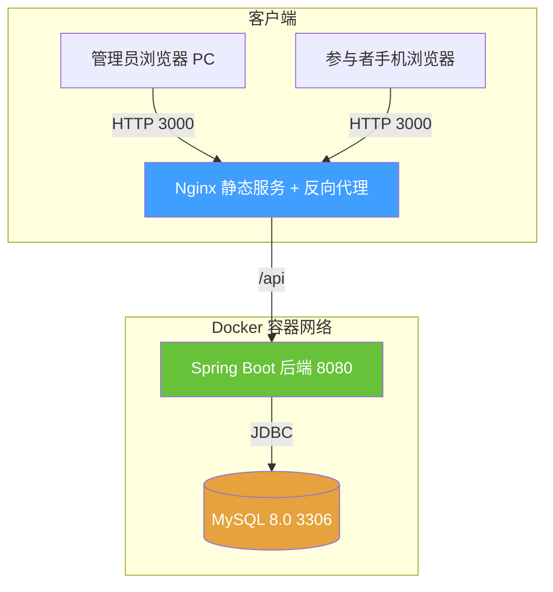
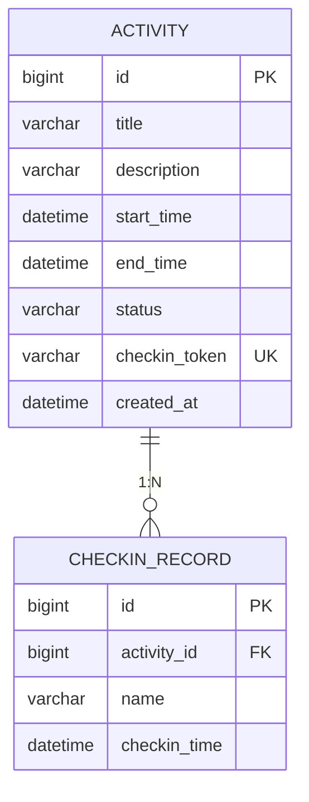
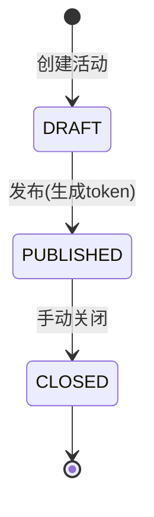
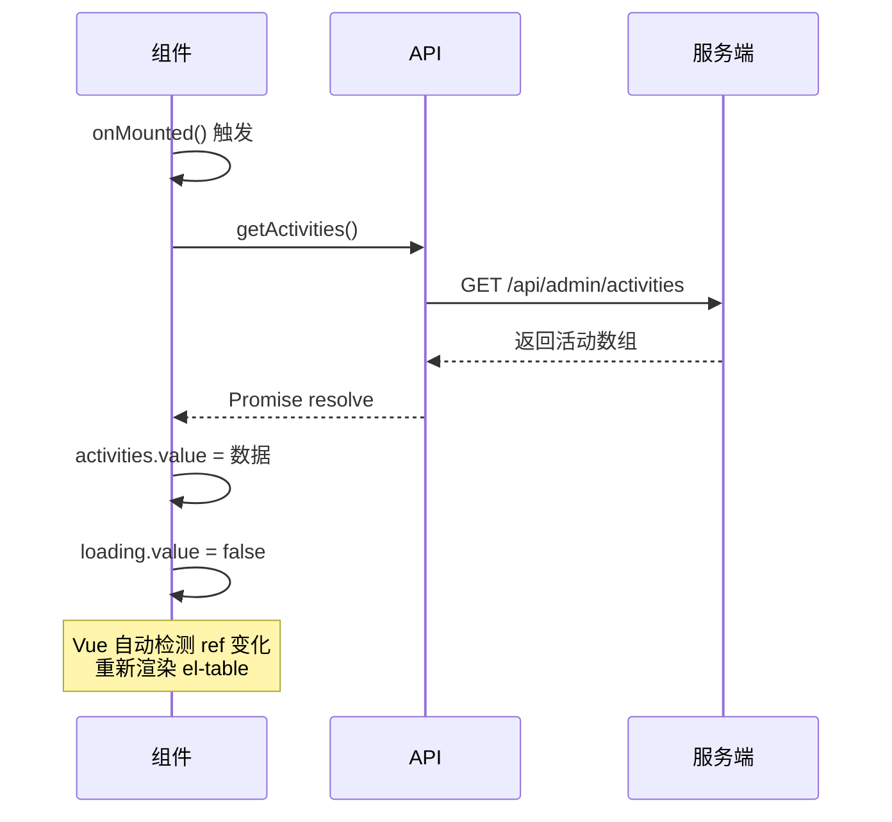

# 文体活动管理平台 - 核心实现解析

## 1. 项目概述

文体活动管理平台是一个**前后端分离**的活动签到管理系统，支持活动创建、发布、二维码签到、实时签到名单查看等功能。

## 2. 系统架构

### 2.1 整体架构图



### 2.2 部署架构说明

系统通过 Docker Compose 编排三个独立服务：

| 服务 | 镜像/构建 | 端口映射 | 依赖 | 说明 |
|---|---|---|---|---|
| `db` | `mysql:8.0` | `3306:3306` | - | 数据持久化，挂载 `mysql-data` 卷 |
| `backend` | `./backend/Dockerfile` 构建 | `8080:8080` | `db` (healthcheck) | Spring Boot RESTful API |
| `frontend` | `./frontend/Dockerfile` 构建 | `3000:80` | `backend` | Nginx 托管前端静态资源，`/api` 反向代理到后端 |

### 2.3 技术栈对比

| 层级 | 技术选型 | 关键依赖 |
|---|---|---|
| 前端 | Vue 3 + Vite + Element Plus | Vue Router 4、Axios、qrcode、dayjs |
| 后端 | Spring Boot 2.7 + Java 17 | Spring Data JPA、Lombok、MySQL Connector |
| 数据库 | MySQL 8.0 | - |
| 基础设施 | Docker + Docker Compose | Nginx Alpine |

---

## 3. 数据库架构

### 3.1 ER 图



### 3.2 核心字段设计

**`activity` 表**
- `checkin_token`: 发布活动时生成的 UUID，作为签到入口的唯一凭证
- `status`: 活动状态枚举（DRAFT / PUBLISHED / CLOSED）
- 唯一约束：`checkin_token` 建立唯一索引

**`checkin_record` 表**
- `activity_id`: 外键关联 `activity.id`
- `checkin_time`: 签到时间戳，自动记录服务端时间而非客户端时间

### 3.3 状态流转



---

## 4. 后端核心模块实现

### 4.1 分层架构

```
com.activities
├── controller/          # 控制层（REST API）
│   ├── AdminController   # 管理端接口 /api/admin/**
│   └── PublicController  # 参与者接口 /api/public/**
├── service/             # 业务层
│   ├── ActivityService   # 活动核心逻辑
│   └── CheckinService    # 签到核心逻辑
├── repository/          # 数据访问层 (JPA)
├── entity/              # JPA 实体
├── dto/                 # 数据传输对象
├── enums/               # 枚举定义
├── exception/           # 全局异常处理
└── config/              # 配置类
```

### 4.2 活动服务 - `ActivityService.java:18-79`

**核心方法：**

```java
// 创建活动（草稿状态）
public Activity createActivity(CreateRequest request)

// 发布活动（关键：生成 UUID token）
@Transactional
public ActivityDto.PublishResponse publishActivity(Long id) {
    Activity activity = getActivity(id);
    String token = UUID.randomUUID().toString();  // 生成签到凭证
    activity.setCheckinToken(token);
    activity.setStatus(ActivityStatus.PUBLISHED);
    return activityRepository.save(activity);
}

// 关闭活动
@Transactional
public Activity closeActivity(Long id)

// 通过 token 查询活动（参与者端使用）
public Activity getActivityByToken(String token)
```

**业务规则：**
- 结束时间不能早于开始时间
- 已发布活动不能重复发布
- 未发布/已关闭的活动无法签到

### 4.3 签到服务 - `CheckinService.java:17-48`

```java
@Transactional
public CheckinRecord checkin(String token, CheckinDto.Request request) {
    Activity activity = activityService.getActivityByToken(token);
    
    // 状态校验
    if (activity.getStatus() == ActivityStatus.CLOSED) 
        throw new IllegalStateException("Activity is closed");
    if (activity.getStatus() != ActivityStatus.PUBLISHED)
        throw new IllegalStateException("Activity is not published");
    
    // 参数校验
    if (request.getName() == null || request.getName().trim().isEmpty())
        throw new IllegalArgumentException("Name is required");
    
    CheckinRecord record = new CheckinRecord();
    record.setActivityId(activity.getId());
    record.setName(request.getName().trim());
    record.setCheckinTime(LocalDateTime.now());  // 服务端时间
    
    return checkinRecordRepository.save(record);
}
```

### 4.4 控制器设计

| Controller | 路由前缀 | 主要接口 |
|---|---|---|
| `AdminController.java:22` | `/api/admin/activities` | 创建/列表/详情/发布/关闭/查询签到名单 |
| `PublicController.java:16` | `/api/public/activities` | `/{token}` 获取活动、`/{token}/checkin` 提交签到 |

---

## 5. 前端核心模块实现

### 5.1 页面路由

```
src/router/index.js
├── /admin                    # 管理端入口
│   ├── /admin                # 活动列表 (ActivityList.vue)
│   └── /admin/activity/:id   # 活动详情 (ActivityDetail.vue)
└── /checkin                  # 参与者入口
    ├── /checkin/:token       # 签到页面 (Checkin.vue)
    └── /checkin/success      # 签到成功 (CheckinSuccess.vue)
```

### 5.2 管理端核心组件

#### `ActivityList.vue` - 活动管理列表

**响应式设计要点：**
- 使用 Vue 3 Composition API（`<script setup>`）
- `ref()` 定义响应式状态：`activities`, `loading`, `showCreateDialog`
- `onMounted()` 钩子触发数据加载

```javascript
const activities = ref([])
const loading = ref(false)

const fetchActivities = async () => {
  loading.value = true
  try {
    activities.value = await getActivities()  // API 调用
  } finally {
    loading.value = false
  }
}

onMounted(fetchActivities)
```

UI 特性：
- 固定操作列 `fixed="right"`
- 状态标签动态颜色映射（DRAFT→info, PUBLISHED→success, CLOSED→danger）
- 发布/关闭操作带二次确认

#### `ActivityDetail.vue:1-210` - 活动详情页

**核心响应式数据：**
```javascript
const activity = ref(null)
const checkins = ref([])
const checkinCount = ref(0)
const qrCodeUrl = ref('')

// 计算属性动态生成签到链接
const checkinLink = computed(() => {
  if (!activity.value?.checkinToken) return ''
  return `${window.location.origin}/checkin/${activity.value.checkinToken}`
})
```

**关键流程：**
1. 进入页面 → `fetchData()` 并行拉取活动详情 + 签到名单
2. 若活动已发布 → 调用 `qrcode.toDataURL()` 生成二维码
3. 响应式布局：左侧 16 列（基本信息 + 签到表格），右侧 8 列（二维码）

### 5.3 参与者端组件

#### `Checkin.vue:1-130` - 移动端签到页

**响应式实现：**
- `activity`、`loading`、`submitting` 使用 `ref()`
- 表单数据 `form` 使用 `reactive()`

```javascript
const form = reactive({ name: '' })

const handleSubmit = async () => {
  if (!form.name.trim()) {
    ElMessage.warning('请输入姓名')
    return
  }
  submitting.value = true
  const res = await checkin(token, { name: form.name })
  router.push({ path: '/checkin/success', query: { ... } })
}
```

**状态判定逻辑：**
```vue
<div v-if="activity.status === 'PUBLISHED'">
  <!-- 显示签到表单 -->
</div>
<el-result v-else icon="warning" title="无法签到" />
```

### 5.4 API 层封装

```
src/api/
├── request.js    # Axios 实例 + 拦截器
└── activity.js   # 业务 API 封装
```

**`request.js`** 统一处理：
- 基础 URL 配置
- 请求/响应拦截器
- 错误统一提示（Element Plus Message）

---

## 6. 响应式设计详解

### 6.1 前端响应式设计模式

Vue 3 Composition API 提供了细粒度的响应式系统，本项目主要使用以下模式：

| API | 用途 | 示例 |
|---|---|---|
| `ref()` | 基本类型响应式 | `const loading = ref(false)` |
| `reactive()` | 对象类型响应式 | `const form = reactive({ name: '' })` |
| `computed()` | 派生状态 | `const checkinLink = computed(...)` |
| `onMounted()` | 生命周期钩子 | `onMounted(fetchData)` |

### 6.2 管理端响应式设计（桌面优先）

```css
/* ActivityList.vue:132-144 */
.activity-list-container {
  padding: 20px;
  max-width: 1200px;      /* 最大宽度限制 */
  margin: 0 auto;         /* 水平居中 */
}
.header {
  display: flex;
  justify-content: space-between;  /* 两端对齐 */
  align-items: center;
}
```

- Element Plus 表格自适应宽度，操作列 `fixed="right"` 固定
- 卡片式布局，留白充足，适合桌面操作

### 6.3 参与者端响应式设计（移动优先）

```css
/* Checkin.vue:96-130 */
.checkin-container {
  min-height: 100vh;
  display: flex;
  justify-content: center;    /* 水平居中 */
  align-items: center;        /* 垂直居中 */
  padding: 20px;              /* 移动端安全边距 */
  background: linear-gradient(...);
}
.checkin-card {
  width: 100%;                /* 小屏占满 */
  max-width: 400px;           /* 大屏限制宽度 */
  border-radius: 12px;
}
```

**移动端适配要点：**
- `min-height: 100vh` 全屏显示
- 渐变背景 + 居中卡片的视觉设计
- `max-width: 400px` 防止大屏过于分散
- 输入框/按钮 `size="large"` 方便触屏操作
- 表单提交按钮宽度 100% 便于点击

### 6.4 响应式数据更新流程

以活动列表为例：



### 6.5 Element Plus 栅格响应式

`ActivityDetail.vue` 使用 Element Plus 栅格系统：
```vue
<el-row :gutter="20">
  <el-col :span="16">  <!-- 左栏 66.7% -->
  <el-col :span="8">   <!-- 右栏 33.3% -->
```
在小屏幕下会自动堆叠（Element Plus 默认 24 栅格，小屏可通过 `:xs` `:sm` 属性进一步优化）。

---

## 7. 关键业务流程图

### 7.1 管理员发布活动流程

```mermaid
flowchart TD
    A[创建活动草稿] -->|POST /api/admin/activities| B[保存 DRAFT 状态]
    B --> C[点击发布]
    C -->|POST /api/admin/activities/{id}/publish| D{状态校验}
    D -->|已发布?| E[抛出异常]
    D -->|草稿?| F[生成 UUID token]
    F --> G[更新状态 PUBLISHED]
    G --> H[返回 token 给前端]
    H --> I[前端跳转详情页]
    I --> J[qrcode.toDataURL 生成二维码]
```

### 7.2 参与者签到流程

```mermaid
flowchart TD
    A[扫描二维码 / 访问链接] --> B[前端路由 /checkin/:token]
    B --> C[GET /api/public/activities/{token}]
    C --> D{活动状态}
    D -->|非 PUBLISHED| E[显示 无法签到 页面]
    D -->|PUBLISHED| F[渲染签到表单]
    F --> G[输入姓名提交]
    G -->|POST /checkin| H{服务端校验}
    H -->|通过| I[保存签到记录]
    I --> J[跳转 success 页面]
    H -->|失败| K[返回错误信息]
```

---

## 8. 项目亮点总结

1. **完整的前后端分离架构**：Vue 3 + Spring Boot，通过 Nginx 反向代理实现同源访问，避免 CORS 问题
2. **基于 Token 的签到机制**：UUID 作为无状态凭证，无需登录即可签到
3. **状态机管理**：DRAFT → PUBLISHED → CLOSED 清晰的活动生命周期
4. **移动端优先的签到页面**：Flex 布局 + 最大宽度限制，适配各种屏幕
5. **响应式数据绑定**：Vue 3 Composition API 配合 Element Plus 组件库，实现高效的 UI 更新
6. **Docker 一键部署**：三容器编排，开发/部署环境一致
7. **全局异常处理**：后端 `GlobalExceptionHandler` + 前端 Axios 拦截器，统一错误处理
