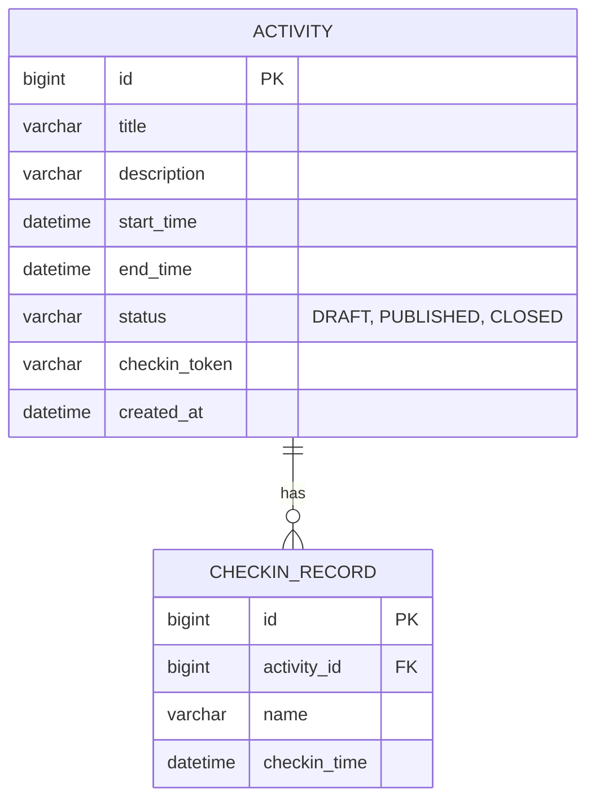

# 详细设计文档 (Detailed Design)

## 1. 数据库设计 (Database Design)

### ER 图 (Entity-Relationship Diagram)



### 数据表定义

#### `activity` (活动表)
| 字段名 | 类型 | 说明 |
| :--- | :--- | :--- |
| `id` | BIGINT | 主键，自增 |
| `title` | VARCHAR(255) | 活动标题 |
| `description` | VARCHAR(1000) | 活动描述 |
| `start_time` | DATETIME | 开始时间 |
| `end_time` | DATETIME | 结束时间 |
| `status` | VARCHAR(20) | 状态：DRAFT, PUBLISHED, CLOSED |
| `checkin_token` | VARCHAR(64) | 签到唯一 Token (发布后生成) |
| `created_at` | DATETIME | 创建时间 |

#### `checkin_record` (签到记录表)
| 字段名 | 类型 | 说明 |
| :--- | :--- | :--- |
| `id` | BIGINT | 主键，自增 |
| `activity_id` | BIGINT | 外键，关联 activity.id |
| `name` | VARCHAR(100) | 签到人姓名 |
| `checkin_time` | DATETIME | 签到时间 |

## 2. API 接口设计 (API Design)

所有接口统一前缀 `/api`。

### 管理端接口 (Admin)

#### 1. 创建活动
- **URL**: `POST /api/admin/activities`
- **Request**:
  ```json
  {
    "title": "年会活动",
    "description": "公司年度盛会",
    "startTime": "2023-12-31T18:00:00",
    "endTime": "2023-12-31T22:00:00"
  }
  ```
- **Response**: `201 Created` (返回 ActivityDto)

#### 2. 列表查询
- **URL**: `GET /api/admin/activities`
- **Response**: `200 OK` (ActivityDto 数组)

#### 3. 发布活动
- **URL**: `POST /api/admin/activities/{id}/publish`
- **Description**: 将状态改为 PUBLISHED，并生成 `checkinToken`。
- **Response**: `200 OK` (返回包含 token 的 ActivityDto)

#### 4. 关闭活动
- **URL**: `POST /api/admin/activities/{id}/close`
- **Response**: `200 OK`

#### 5. 获取签到名单
- **URL**: `GET /api/admin/activities/{id}/checkins`
- **Response**: `200 OK` (CheckinRecordDto 数组)

### 参与者接口 (Public)

#### 1. 获取活动信息
- **URL**: `GET /api/public/activities/{token}`
- **Response**: `200 OK` (ActivityDto)

#### 2. 提交签到
- **URL**: `POST /api/public/activities/{token}/checkin`
- **Request**:
  ```json
  {
    "name": "张三"
  }
  ```
- **Response**: `200 OK` (包含签到信息的 CheckinDto)

## 3. 前端组件设计 (Frontend Components)

### 页面结构
- **管理端 (`/admin`)**
  - `ActivityList.vue`: 核心管理页，展示列表，包含新建表单弹窗。
  - `ActivityDetail.vue`: 详情页，包含信息展示、二维码区域、签到名单表格。
- **参与者端 (`/checkin/:token`)**
  - `Checkin.vue`: 简洁的移动端优先页面，仅展示关键信息和输入框。
  - `CheckinSuccess.vue`: 成功反馈页。

### 核心逻辑
- **路由守卫**: 根据路径区分管理端和公开端布局（目前共享 App.vue，通过路由 View 渲染）。
- **API 封装**: `request.js` 统一处理 Axios 拦截器，自动处理错误提示。
