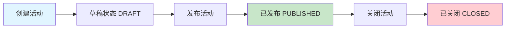
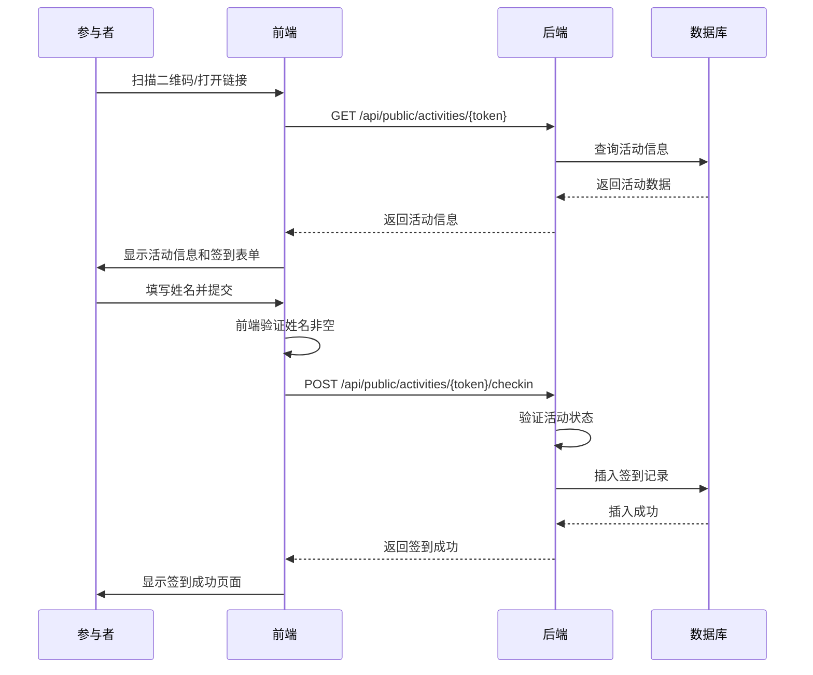

# 文体活动管理平台 - 业务逻辑与验证指南

## 📖 项目概述

本文档详细梳理文体活动管理平台的核心业务逻辑，并提供验证指南。

---

## 🎯 核心业务流程

### 1. 活动生命周期管理



### 2. 签到流程



---

## ✅ 验证指南

### 1. 启动服务
确保 Docker Desktop 已运行，在 `activities` 目录下执行：
```bash
docker compose up --build
```
等待容器启动完成（首次启动需要下载镜像和编译，可能需要几分钟）。

### 2. 管理端验证
1. **访问首页**：浏览器打开 [http://localhost:3000](http://localhost:3000)
2. **创建活动**：
   - 点击"创建活动"
   - 填写标题（如"部门团建"）、时间、说明
   - 点击"创建"
   - **预期**：列表页出现新活动，状态为"DRAFT"。
3. **发布活动**：
   - 点击"发布"按钮
   - **预期**：状态变为"PUBLISHED"，出现"发布成功"提示。
4. **查看详情**：
   - 点击"详情"
   - **预期**：看到活动信息、二维码、签到链接、签到名单（空）。

### 3. 参与者端验证
1. **进入签到页**：
   - 在详情页复制签到链接，或直接点击/扫码
   - **预期**：打开签到页面，显示活动标题和时间。
2. **提交签到**：
   - 输入姓名（如"王小明"）
   - 点击"签到打卡"
   - **预期**：跳转到成功页，显示"签到成功"。
3. **重复签到**（可选测试）：
   - 再次访问链接签到
   - **预期**：系统允许重复签到（根据当前设计），或显示成功。

### 4. 结果查看与管理
1. **查看结果**：
   - 回到管理端详情页
   - **预期**：签到人数+1，名单列表中出现"王小明"。
2. **关闭活动**：
   - 点击"关闭"或在列表页点击"关闭"
   - **预期**：状态变为"CLOSED"。
   - 再次尝试签到 -> **预期**：提示"活动已关闭"。

---

## 🛠 开发总结

### 关键功能实现
- **全栈开发**：使用 Spring Boot 2 + Vue 3 实现了完整的业务流。
- **Docker 化**：通过 Docker Compose 编排了 MySQL、后端 API 和前端 Nginx 服务。
- **交互优化**：
  - 前端使用 Element Plus 打造现代化 UI。
  - 实现了扫码签到等便捷功能。
  - 增加了 Loading、Toast 等交互反馈。

### 数据模型
- **Activity**: 管理活动状态和生命周期。
- **CheckinRecord**: 记录签到数据。
